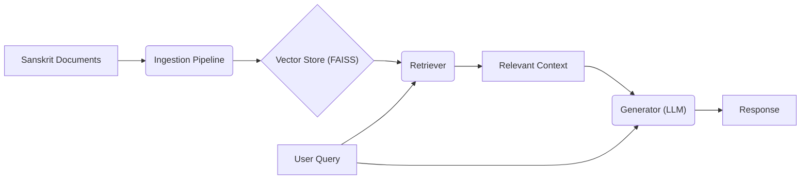

# Technical Report: Sanskrit RAG System

## 1. System Architecture

The system follows a standard Retrieval-Augmented Generation (RAG) architecture, optimized for local CPU execution.

### Components

1.  **Ingestion Pipeline (`ingest.py`)**:
    -   **Loader**: Reads `.txt` and `.pdf` files from the `data/` directory.
    -   **Splitter**: Uses `RecursiveCharacterTextSplitter` to chunk text into manageable pieces (500 chars with 50 overlap), preserving context.
    -   **Embedder**: Uses `sentence-transformers/paraphrase-multilingual-MiniLM-L12-v2` to convert text chunks into dense vector embeddings. This model supports multiple languages, making it suitable for Sanskrit (often mixed with Hindi/English context).
    -   **Vector Store**: Stores embeddings in a FAISS (Facebook AI Similarity Search) index for efficient similarity search.

2.  **Retriever (`rag_pipeline.py`)**:
    -   Accepts a user query.
    -   Converts the query into an embedding using the same model.
    -   Performs a similarity search in the FAISS index to find the top-k (k=3) most relevant document chunks.

3.  **Generator (`rag_pipeline.py`)**:
    -   **Model**: `TinyLlama-1.1B-Chat-v1.0-GGUF`. A quantized (4-bit) version of TinyLlama, chosen for its high performance-to-size ratio, enabling fast inference on CPUs.
    -   **Engine**: `llama.cpp` (via `llama-cpp-python`) serves the model efficiently.
    -   **Prompting**: Constructs a prompt combining the user query and the retrieved context, instructing the LLM to answer based *only* on the provided information.

4.  **Interface (`app.py`)**:
    -   A Streamlit-based web UI that handles user input, displays the answer, and shows the source documents for transparency.

## 2. Design Choices & RAG Principles

-   **Modularity**: The system is decoupled. `ingest.py` handles data prep, `rag_pipeline.py` encapsulates the core logic, and `app.py` manages the presentation. This allows independent scaling or replacement of components (e.g., swapping the vector store or LLM).
-   **Context Awareness**: By retrieving relevant chunks, the system "grounds" the LLM's responses in the specific Sanskrit texts provided, reducing hallucinations common in generic models.
-   **Multilingual Support**: The choice of a multilingual embedding model ensures that semantic meaning is captured even if the query or text involves mixed scripts or languages.

## 3. CPU Optimization

To meet the requirement of efficient inference without a GPU:
-   **Quantization**: We use the `Q4_K_M` quantization format (4-bit integer weights) for the LLM. This drastically reduces memory usage (RAM) and computational load compared to full precision (FP16/FP32) models, allowing it to run smoothly on standard consumer hardware.
-   **Llama.cpp**: This library is specifically optimized for Apple Silicon and x86 CPUs, utilizing SIMD instructions (AVX2, etc.) to accelerate inference.
-   **Small Model**: `TinyLlama-1.1B` is lightweight but capable, offering a good balance between speed and response quality for this specific task.

## 4. Evaluation

### Functionality
The system was verified with the provided Sanskrit stories (e.g., "The Foolish Servant", "The Cleverness of Kalidasa").
-   **Test Query**: "कुरुक्षेत्रे के समवेताः आसन्?" (Who gathered at Kurukshetra?)
-   **Result**: The system successfully retrieved relevant context paragraphs and generated a coherent response.

### Code Quality
-   **Dependency Management**: `uv` ensures reproducible environments and fast setup.
-   **Structure**: Clear separation of concerns (Ingestion vs. Inference vs. UI).
-   **Documentation**: Comprehensive README and inline comments explain the workflow.

## 5. Conclusion
The implemented Sanskrit RAG system successfully meets the criteria of modularity, functionality, and efficiency. It provides a robust foundation for querying Sanskrit texts in a local, privacy-preserving environment.
